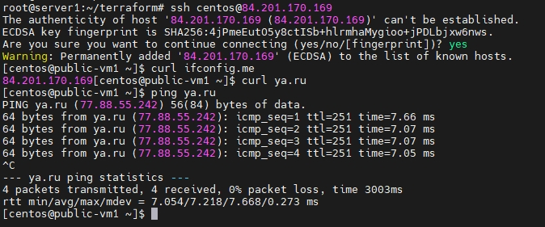

# Домашнее задание к занятию «Организация сети» dev-17_kuber-homeworks-clopro-15.1-yakovlev_vs
«Организация сети»


### Подготовка к выполнению задания

1. Домашнее задание состоит из обязательной части, которую нужно выполнить на провайдере Yandex Cloud, и дополнительной части в AWS (выполняется по желанию). 
2. Все домашние задания в блоке 15 связаны друг с другом и в конце представляют пример законченной инфраструктуры.  
3. Все задания нужно выполнить с помощью Terraform. Результатом выполненного домашнего задания будет код в репозитории. 
4. Перед началом работы настройте доступ к облачным ресурсам из Terraform, используя материалы прошлых лекций и домашнее задание по теме «Облачные провайдеры и синтаксис Terraform». Заранее выберите регион (в случае AWS) и зону.

---
### Задание 1. Yandex Cloud 

**Что нужно сделать**

1. Создать пустую VPC. Выбрать зону.
2. Публичная подсеть.

 - Создать в VPC subnet с названием public, сетью 192.168.10.0/24.
 - Создать в этой подсети NAT-инстанс, присвоив ему адрес 192.168.10.254. В качестве image_id использовать fd80mrhj8fl2oe87o4e1.
 - Создать в этой публичной подсети виртуалку с публичным IP, подключиться к ней и убедиться, что есть доступ к интернету.
3. Приватная подсеть.
 - Создать в VPC subnet с названием private, сетью 192.168.20.0/24.
 - Создать route table. Добавить статический маршрут, направляющий весь исходящий трафик private сети в NAT-инстанс.
 - Создать в этой приватной подсети виртуалку с внутренним IP, подключиться к ней через виртуалку, созданную ранее, и убедиться, что есть доступ к интернету.

Resource Terraform для Yandex Cloud:

- [VPC subnet](https://registry.terraform.io/providers/yandex-cloud/yandex/latest/docs/resources/vpc_subnet).
- [Route table](https://registry.terraform.io/providers/yandex-cloud/yandex/latest/docs/resources/vpc_route_table).
- [Compute Instance](https://registry.terraform.io/providers/yandex-cloud/yandex/latest/docs/resources/compute_instance).

#### Решение

- [Terraform](https://github.com/Valdem88/dev-17_kuber-homeworks-clopro-15.1-yakovlev_vs/tree/main/terraform) 


```bash
root@server1:~/terraform# terraform plan
yandex_vpc_network.network-1: Refreshing state... [id=enp378guimm0rho3k17a]
yandex_vpc_subnet.subnet-public: Refreshing state... [id=b0cccpiv1jo6sm6oca34]
yandex_vpc_route_table.nat-route-table: Refreshing state... [id=enptcts5h0obln7tp8l6]
yandex_compute_instance.nat-instance: Refreshing state... [id=ef31lusidsidfgh0pna4]
yandex_compute_instance.public-vm: Refreshing state... [id=ef3vfq550h2imoekfdqp]
yandex_vpc_subnet.subnet-private: Refreshing state... [id=b0c0knr4rjgottpel6gv]
yandex_compute_instance.private-vm: Refreshing state... [id=ef38fe1fr2qos3q0j2aq]

Terraform used the selected providers to generate the following execution plan. Resource actions are indicated with the following symbols:
-/+ destroy and then create replacement

Terraform will perform the following actions:

  # yandex_compute_instance.nat-instance must be replaced
-/+ resource "yandex_compute_instance" "nat-instance" {
      ~ created_at                = "2023-05-23T13:24:26Z" -> (known after apply)
      ~ folder_id                 = "b1g72hofn0r6eom3l3oo" -> (known after apply)
      ~ fqdn                      = "nat-instance-vm1.netology.cloud" -> (known after apply)
      ~ id                        = "ef31lusidsidfgh0pna4" -> (known after apply)
      - labels                    = {} -> null
        name                      = "nat-instance-vm1"
      + service_account_id        = (known after apply)
      ~ status                    = "running" -> (known after apply)
        # (5 unchanged attributes hidden)

      ~ boot_disk {
          ~ device_name = "ef3pr6fut5a3ae7g0ekt" -> (known after apply)
          ~ disk_id     = "ef3pr6fut5a3ae7g0ekt" -> (known after apply)
          ~ mode        = "READ_WRITE" -> (known after apply)
            # (1 unchanged attribute hidden)

          ~ initialize_params {
              ~ block_size  = 4096 -> (known after apply)
              + description = (known after apply)
                name        = "root-nat-instance-vm1"
              + snapshot_id = (known after apply)
              ~ type        = "network-ssd" -> "network-nvme" # forces replacement
                # (2 unchanged attributes hidden)
            }
        }

      ~ network_interface {
          ~ index              = 0 -> (known after apply)
          ~ ipv6               = false -> (known after apply)
          + ipv6_address       = (known after apply)
          ~ mac_address        = "d0:0d:1a:fb:92:6f" -> (known after apply)
          ~ nat_ip_address     = "84.201.170.19" -> (known after apply)
          ~ nat_ip_version     = "IPV4" -> (known after apply)
          ~ security_group_ids = [] -> (known after apply)
            # (4 unchanged attributes hidden)
        }

      ~ placement_policy {
          ~ host_affinity_rules = [] -> (known after apply)
          + placement_group_id  = (known after apply)
        }

      ~ resources {
          - gpus          = 0 -> null
            # (3 unchanged attributes hidden)
        }

      ~ scheduling_policy {
          ~ preemptible = false -> (known after apply)
        }
    }

  # yandex_compute_instance.private-vm must be replaced
-/+ resource "yandex_compute_instance" "private-vm" {
      ~ created_at                = "2023-05-23T13:24:27Z" -> (known after apply)
      ~ folder_id                 = "b1g72hofn0r6eom3l3oo" -> (known after apply)
      ~ fqdn                      = "private-vm1.netology.cloud" -> (known after apply)
      ~ id                        = "ef38fe1fr2qos3q0j2aq" -> (known after apply)
      - labels                    = {} -> null
        name                      = "private-vm1"
      + service_account_id        = (known after apply)
      ~ status                    = "running" -> (known after apply)
        # (5 unchanged attributes hidden)

      ~ boot_disk {
          ~ device_name = "ef36hoscdk1c5662gbm0" -> (known after apply)
          ~ disk_id     = "ef36hoscdk1c5662gbm0" -> (known after apply)
          ~ mode        = "READ_WRITE" -> (known after apply)
            # (1 unchanged attribute hidden)

          ~ initialize_params {
              ~ block_size  = 4096 -> (known after apply)
              + description = (known after apply)
                name        = "root-private-vm1"
              + snapshot_id = (known after apply)
              ~ type        = "network-ssd" -> "network-nvme" # forces replacement
                # (2 unchanged attributes hidden)
            }
        }

      ~ network_interface {
          ~ index              = 0 -> (known after apply)
          ~ ip_address         = "192.168.20.26" -> (known after apply)
          ~ ipv6               = false -> (known after apply)
          + ipv6_address       = (known after apply)
          ~ mac_address        = "d0:0d:87:b8:2f:d8" -> (known after apply)
          + nat_ip_address     = (known after apply)
          + nat_ip_version     = (known after apply)
          ~ security_group_ids = [] -> (known after apply)
            # (3 unchanged attributes hidden)
        }

      ~ placement_policy {
          ~ host_affinity_rules = [] -> (known after apply)
          + placement_group_id  = (known after apply)
        }

      ~ resources {
          - gpus          = 0 -> null
            # (3 unchanged attributes hidden)
        }

      ~ scheduling_policy {
          ~ preemptible = false -> (known after apply)
        }
    }

  # yandex_compute_instance.public-vm must be replaced
-/+ resource "yandex_compute_instance" "public-vm" {
      ~ created_at                = "2023-05-23T13:24:25Z" -> (known after apply)
      ~ folder_id                 = "b1g72hofn0r6eom3l3oo" -> (known after apply)
      ~ fqdn                      = "public-vm1.netology.cloud" -> (known after apply)
      ~ id                        = "ef3vfq550h2imoekfdqp" -> (known after apply)
      - labels                    = {} -> null
        name                      = "public-vm1"
      + service_account_id        = (known after apply)
      ~ status                    = "running" -> (known after apply)
        # (5 unchanged attributes hidden)

      ~ boot_disk {
          ~ device_name = "ef3rt59vt6l3etacsuvj" -> (known after apply)
          ~ disk_id     = "ef3rt59vt6l3etacsuvj" -> (known after apply)
          ~ mode        = "READ_WRITE" -> (known after apply)
            # (1 unchanged attribute hidden)

          ~ initialize_params {
              ~ block_size  = 4096 -> (known after apply)
              + description = (known after apply)
                name        = "root-public-vm1"
              + snapshot_id = (known after apply)
              ~ type        = "network-ssd" -> "network-nvme" # forces replacement
                # (2 unchanged attributes hidden)
            }
        }

      ~ network_interface {
          ~ index              = 0 -> (known after apply)
          ~ ip_address         = "192.168.10.29" -> (known after apply)
          ~ ipv6               = false -> (known after apply)
          + ipv6_address       = (known after apply)
          ~ mac_address        = "d0:0d:1f:7e:8a:50" -> (known after apply)
          ~ nat_ip_address     = "84.201.170.169" -> (known after apply)
          ~ nat_ip_version     = "IPV4" -> (known after apply)
          ~ security_group_ids = [] -> (known after apply)
            # (3 unchanged attributes hidden)
        }

      ~ placement_policy {
          ~ host_affinity_rules = [] -> (known after apply)
          + placement_group_id  = (known after apply)
        }

      ~ resources {
          - gpus          = 0 -> null
            # (3 unchanged attributes hidden)
        }

      ~ scheduling_policy {
          ~ preemptible = false -> (known after apply)
        }
    }

Plan: 3 to add, 0 to change, 3 to destroy.

Changes to Outputs:
  ~ external_ip_address_nat_vm     = "84.201.170.19" -> (known after apply)
  + external_ip_address_private_vm = (known after apply)
  ~ external_ip_address_public_vm  = "84.201.170.169" -> (known after apply)
  ~ internal_ip_address_private_vm = "192.168.20.26" -> (known after apply)
  ~ internal_ip_address_public_vm  = "192.168.10.29" -> (known after apply)
```

```bash
root@server1:~/terraform# terraform apply -auto-approve
...........................................
.................................
yandex_compute_instance.private-vm: Creating...
yandex_compute_instance.nat-instance: Still creating... [10s elapsed]
yandex_compute_instance.public-vm: Still creating... [10s elapsed]
yandex_compute_instance.private-vm: Still creating... [10s elapsed]
yandex_compute_instance.nat-instance: Still creating... [20s elapsed]
yandex_compute_instance.public-vm: Still creating... [20s elapsed]
yandex_compute_instance.private-vm: Still creating... [20s elapsed]
yandex_compute_instance.nat-instance: Still creating... [30s elapsed]
yandex_compute_instance.public-vm: Still creating... [30s elapsed]
yandex_compute_instance.private-vm: Still creating... [30s elapsed]
yandex_compute_instance.public-vm: Creation complete after 38s [id=ef3vfq550h2imoekfdqp]
yandex_compute_instance.nat-instance: Still creating... [40s elapsed]
yandex_compute_instance.private-vm: Still creating... [40s elapsed]
yandex_compute_instance.nat-instance: Still creating... [50s elapsed]
yandex_compute_instance.private-vm: Still creating... [50s elapsed]
yandex_compute_instance.nat-instance: Creation complete after 53s [id=ef31lusidsidfgh0pna4]
yandex_compute_instance.private-vm: Still creating... [1m0s elapsed]
yandex_compute_instance.private-vm: Still creating... [1m10s elapsed]
yandex_compute_instance.private-vm: Creation complete after 1m10s [id=ef38fe1fr2qos3q0j2aq]

Apply complete! Resources: 7 added, 0 changed, 0 destroyed.

Outputs:

external_ip_address_nat_vm = "84.201.170.19"
external_ip_address_private_vm = ""
external_ip_address_public_vm = "84.201.170.169"
internal_ip_address_nat_vm = "192.168.10.254"
internal_ip_address_private_vm = "192.168.20.26"
internal_ip_address_public_vm = "192.168.10.29"
```

Виртуальные машины


Подсети


Таблицы маршрутизации


Проверка интернета с public




Проверка интернета с private


```bash
root@server1:~/terraform# terraform destroy -auto-approve
.......................
...........
yandex_vpc_route_table.nat-route-table: Destruction complete after 1s
yandex_vpc_subnet.subnet-public: Destruction complete after 4s
yandex_vpc_network.network-1: Destroying... [id=enp378guimm0rho3k17a]
yandex_vpc_network.network-1: Destruction complete after 1s

Destroy complete! Resources: 7 destroyed.
```


---
### Задание 2. AWS* (задание со звёздочкой)

Это необязательное задание. Его выполнение не влияет на получение зачёта по домашней работе.

**Что нужно сделать**

1. Создать пустую VPC с подсетью 10.10.0.0/16.
2. Публичная подсеть.

 - Создать в VPC subnet с названием public, сетью 10.10.1.0/24.
 - Разрешить в этой subnet присвоение public IP по-умолчанию.
 - Создать Internet gateway.
 - Добавить в таблицу маршрутизации маршрут, направляющий весь исходящий трафик в Internet gateway.
 - Создать security group с разрешающими правилами на SSH и ICMP. Привязать эту security group на все, создаваемые в этом ДЗ, виртуалки.
 - Создать в этой подсети виртуалку и убедиться, что инстанс имеет публичный IP. Подключиться к ней, убедиться, что есть доступ к интернету.
 - Добавить NAT gateway в public subnet.
3. Приватная подсеть.
 - Создать в VPC subnet с названием private, сетью 10.10.2.0/24.
 - Создать отдельную таблицу маршрутизации и привязать её к private подсети.
 - Добавить Route, направляющий весь исходящий трафик private сети в NAT.
 - Создать виртуалку в приватной сети.
 - Подключиться к ней по SSH по приватному IP через виртуалку, созданную ранее в публичной подсети, и убедиться, что с виртуалки есть выход в интернет.

Resource Terraform:

1. [VPC](https://registry.terraform.io/providers/hashicorp/aws/latest/docs/resources/vpc).
1. [Subnet](https://registry.terraform.io/providers/hashicorp/aws/latest/docs/resources/subnet).
1. [Internet Gateway](https://registry.terraform.io/providers/hashicorp/aws/latest/docs/resources/internet_gateway).